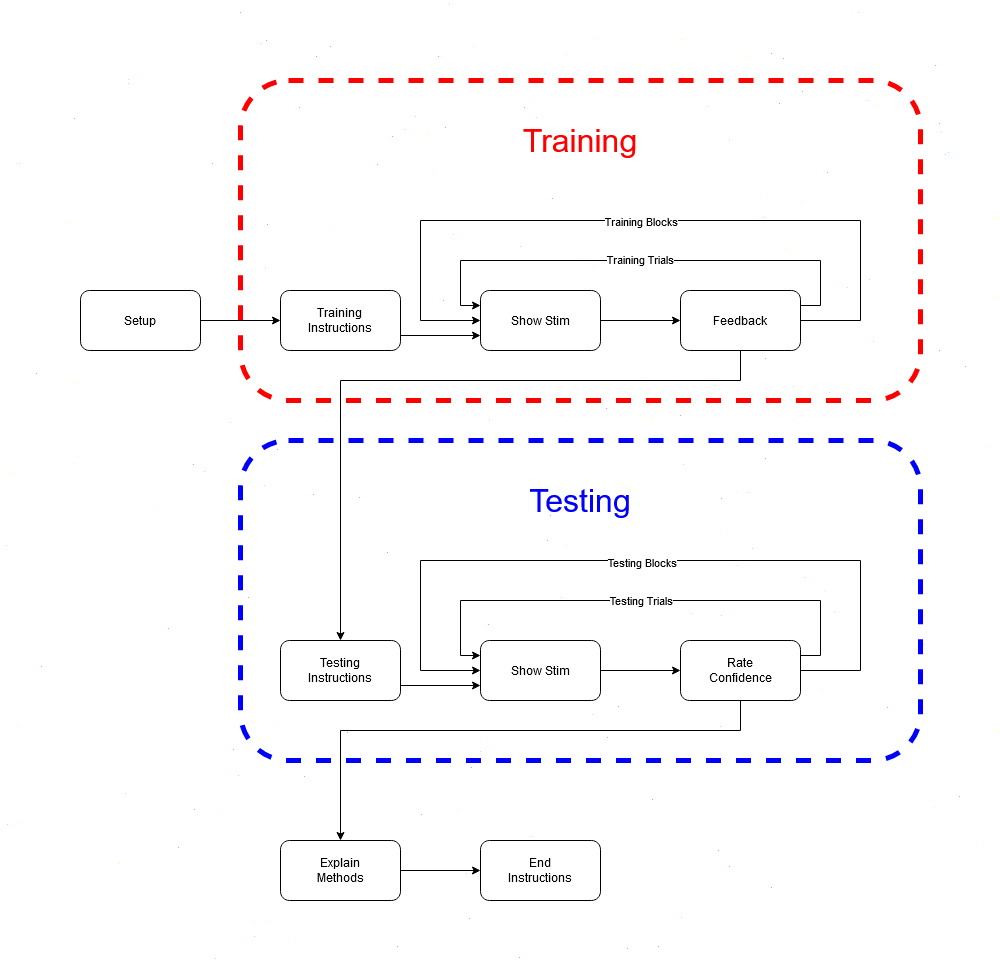

# Charts

## Description

The "Charts" task is an experiment designed to monitor a subject's progress in learning
a deterministic categorization and analyze their subsequent generalizations. Each stimulus
item in the experiment is composed of four binary dimensions and are presented to the subjects
as a patient chart listing four symptoms: Muscles (*tense* or *relaxed*), Insulin (*high* or
*low*), Glands (*swollen* or *recessed*), and Sinus (*stuffy* or *runny*). The complete stimulus
set consists of 16 possible patterns resulting from forming all combinations of the four binary 
dimensions. When The experiment consists of a training phase and a testing phase. The stimulus
set is divided equally between these two phases: eight patterns for training and eight patterns
for testing (Pavel et al. 1988).

During each trial in the experiment the subject is shown a "patient's chart" listing four
symptoms (described above). The subject must categorize the patient's symptoms into one of two
diseases: Purosis or Turitis. The training stimuli are carefully selected so that the
categorization can be perfectly performed by an exclusive-or (XOR) on the last two dimensions,
while the first two dimensions could be used to form a simpler but less effective rule (Pavel
et al., 1988). 

### References

Pavel, M., Gluck, M., & Henkle, V. (1988, August 17). Generalization by humans and multi-layer adaptive networks. Tenth Annual Conference of the Cognitive Science Society. Tenth Annual Conference of the Cognitive Science Society.

Society, C.S. (Ed.). (1988). 10th Annual Conference Cognitive Science Society Pod (1st ed.).
Psychology Press. https://doi.org/10.4324/9781315807812

## Data
PsychoPy automatically generates a data file which contains all the necessary information about
the experiment, each stimulus and subject response (found in the `GluckLab/charts/data/`
directory). In addition to the data automatically generated by PsychoPy, a custom field 
(`subject_methods_explanation`) was added to the file. This field contains the text entered by
the subject when prompted to explain the methods they used to make their diagnoses.

## PsychoPy Implementation



- Setup:
  - Begin experiment:
    - Imports libraries to be used.
    - Initializes variables used throughout the experiment.
    - Sets the paths to the conditions files.
    - Randomizes the training stimuli.
  
- Training Instructions:
  - Begin routine:
    - Simple screen with text instructions explaining the task and the training phase.

- Show Stim (training and testing phase):
  - Begin routine:
    - Creates the patient's chart text as a formatted string based on the current conditions.
    - Shows the patients chart to subject along with the two disease options.
    - Records the patients diagnosis as a keyboard response.

- Feedback (training phase only):
  - Begin routine:
    - Generates and shows feedback text ("Correct" or "Incorrect") based on the subject's
    response.
    - Sets the opacity of whichever disease was NOT chosen as the diagnosis to zero.
  - End Routine:
    - Keeps track of how many consecutive correct answers has the subject given.
    - Terminates the training phase if the subject has reached criterion (32 consecutive correct
    answers).

- Testing Instructions:
  - Begin routine:
    -  Simple screen with text instructions explaining the testing phase.
  
-  Rate Confidence (testing phase only):
   -  Begin routine:
      -  Prompts the subject to rate how confident they are in their current diagnosis on a scale of 1-7.
      -  Shows a slider on which the subject can rate their confidence.

- Explain Methods:
  - Uses custom code to modify a text stimulus into a free-text entry component (explanation in
  next section).
  - Begin routine:
    - Prompts the user to explain their methods of diagnosis.
  - Each frame:
    - Records keyboard input.
    - Updates the text stimulus on screen to reflect the keyboard input.
  - End routine:
    - Records the text inputted by the subject to data file.
  
## Randomizing Stimuli

As described earlier, the training stimuli were carefully selected so that the categorization
could be perfectly performed with an XOR on the last two dimensions. However, this does not mean
that the training stimuli are the same for every subject. The symptom names associated with
each dimension must be randomized across subjects. To do this:
- The stimuli are generated first as 4-bit binary sequences representing the numbers 0 through 15. 
- The training sequences are hard coded into the experiment. Half belonging to category A, 
and the other half to category B.
- The testing sequences are all those sequences which are not training sequences.
- A two-element list is created for each symptom containing the corresponding names for that
symptom.
- Another two-element list is created with elements corresponding to each disease (or category).
- Each of these lists are randomly shuffled.
- For every training binary sequence:
  - The value of each bit is used as the index in each of the symptom names lists. For example,
  if the sequence is `0101`, then the corresponding stimuli will be `[muscles_list[0], 
  insulin_list[1], glands_list[0], sinus_list[1]]`.
  - Training stimuli belonging to category A are written to the training conditions file as 
    belonging to the disease at index `0`, and the training stimuli belonging to category B as
    belonging at index `1`.
  - Since all these lists have been randomly shuffled, then the symptom names associated with 
  each dimension as well as what set of symptoms are associated to which disease are randomized
  every time the experiment is run.

### Code
```python
header = ["phase", "muscles", "insulin", "glands", "sinus", "category"]
muscles_list = ["tense", "relaxed"]
insulin_list = ["high", "low"]
glands_list = ["swollen", "recessed"]
sinus_list = ["stuffy", "runny"]
categories = [left_key, right_key]

binary_conditions = [bin(i)[2:].zfill(4) for i in range(16)]
training_stimuli_a = ["1111", "1100", "0111", "1000"]
training_stimuli_b = ["0010", "0001", "1010", "0101"]
training_stimuli = training_stimuli_a + training_stimuli_b
testing_stimuli = [x for x in binary_conditions if x not in training_stimuli]

random.shuffle(categories)
random.shuffle(muscles_list)
random.shuffle(insulin_list)
random.shuffle(glands_list)
random.shuffle(sinus_list)

with open(conditions["training"], mode="w" ,newline="") as f:
    writer = csv.writer(f, delimiter=",", quotechar='"', quoting=csv.QUOTE_ALL)
    writer.writerow(header)
    for bin_con in training_stimuli_a :
        condition = ["training",
                    muscles_list[int(bin_con[0])],
                    insulin_list[int(bin_con[1])],
                    glands_list[int(bin_con[2])],
                    sinus_list[int(bin_con[3])],
                    categories[0]]
        writer.writerow(condition)
    for bin_con in training_stimuli_b:
        condition = ["training",
                    muscles_list[int(bin_con[0])],
                    insulin_list[int(bin_con[1])],
                    glands_list[int(bin_con[2])],
                    sinus_list[int(bin_con[3])],
                    categories[1]]
        writer.writerow(condition)
```

## Creating a free-text response component

The experiment design specifies that after the testing phase the subject should be prompted to
explain the methods they used to make their diagnoses. Although this could be simply be left up
to the experimenter, it would be more convenient to have the subject write it and record their
response directly to the data file. 

Unfortunately PsychoPy does not seem to have a free-text response component by default, so
we had to find a work around by using a text stimuli, a keyboard response component and some
custom code. In searching for solutions we found a [Stack Overflow question](https://stackoverflow.com/questions/26274454/getting-free-text-string-input-from-participant) dealing
with the same issue. The solution applied in this experiment is a modified version of the
solution offered in this question.

To summarize our solution, we basically record all the key strokes the subject
enters using the keyboard response component and update the text stimuli to reflect the 
keys the subject has pressed so far. We end the routine once the subject presses the enter key
and record the final text to the data file.

### Code

#### Begin Experiment
```python
input_text = ""
# Keys that are accepted by the keyboard reponse component
explanation_keys = list(string.ascii_letters) + list(string.digits) + ["period", "comma", "space", "return", "lshift", "rshift", "backspace"]
```

#### Begin routine
```python
shift_flag = False
prompt = "Please describe the methods you used to make your diagnoses. Press \"enter\" to submit."
```

#### Each frame
```python
n = len(subject_explanation.keys)
i = 0
input_text = ""
while i < n:

    if subject_explanation.keys[i] == 'return':
        # pressing RETURN means time to stop
        continueRoutine = False
        break

    elif subject_explanation.keys[i] == 'backspace':
        input_text = input_text[:-1]  # lose the final character
        i += 1

    elif subject_explanation.keys[i] == 'space':
        input_text += ' '
        i += 1
        
    elif subject_explanation.keys[i] == "period":
        input_text += "."
        i += 1
    
    elif subject_explanation.keys[i] == "comma":
        input_text += ","
        i += 1

    elif subject_explanation.keys[i] in ['lshift', 'rshift']:
        shift_flag = True
        i += 1

    else:
        if len(subject_explanation.keys[i]) == 1:
            # we only have 1 char so should be a normal key, 
            # otherwise it might be 'ctrl' or similar so ignore it
            if shift_flag:
                input_text += chr( ord(subject_explanation.keys[i]) - ord(' '))
                shift_flag = False
            else:
                input_text += subject_explanation.keys[i]

        i += 1
```
#### End routine
```python
# let's store the final text string into the data file
thisExp.addData('subject_methods_explanation', input_text)
```