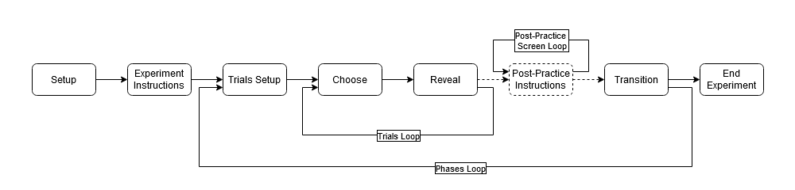
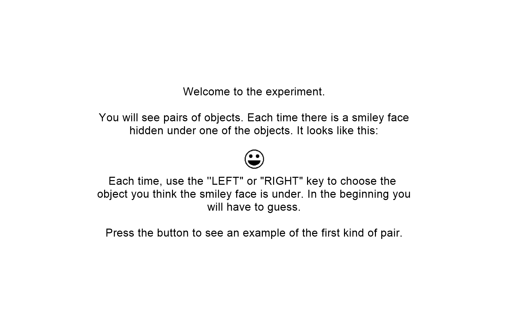
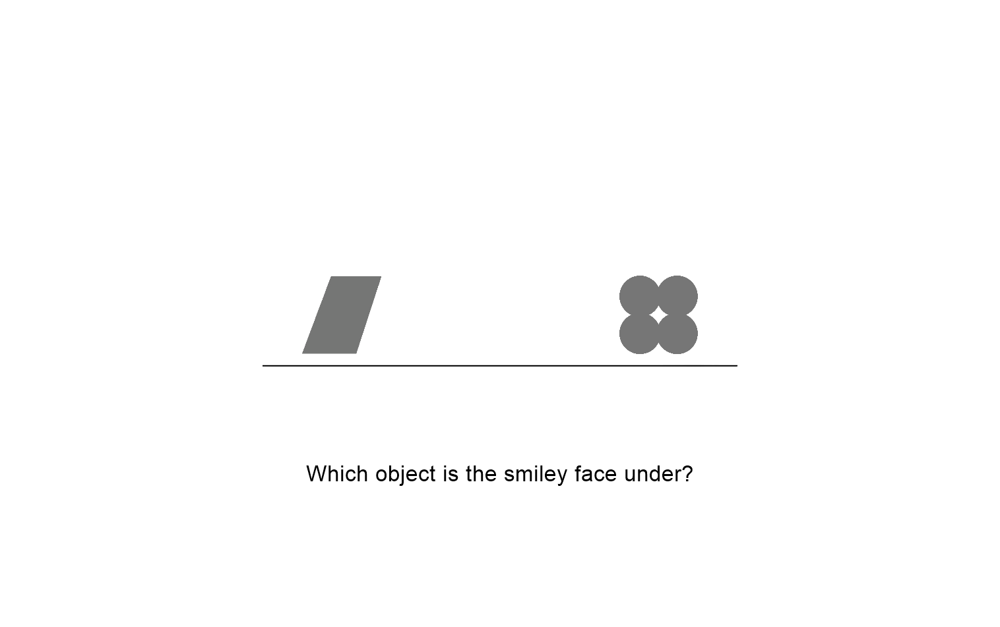
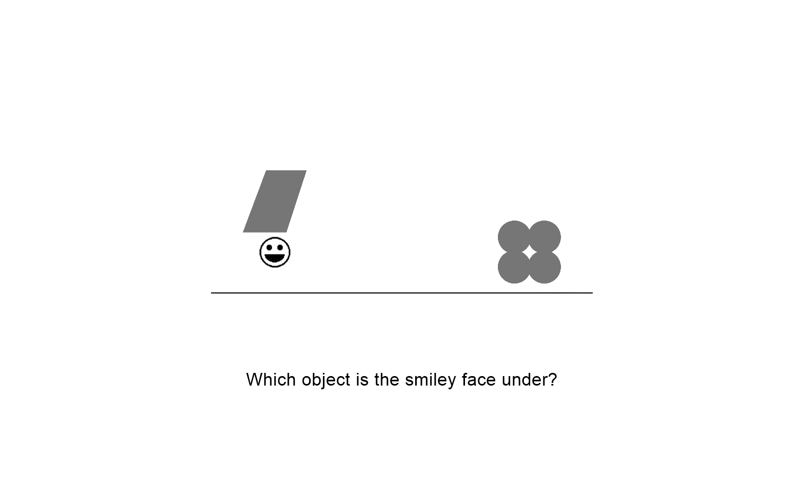
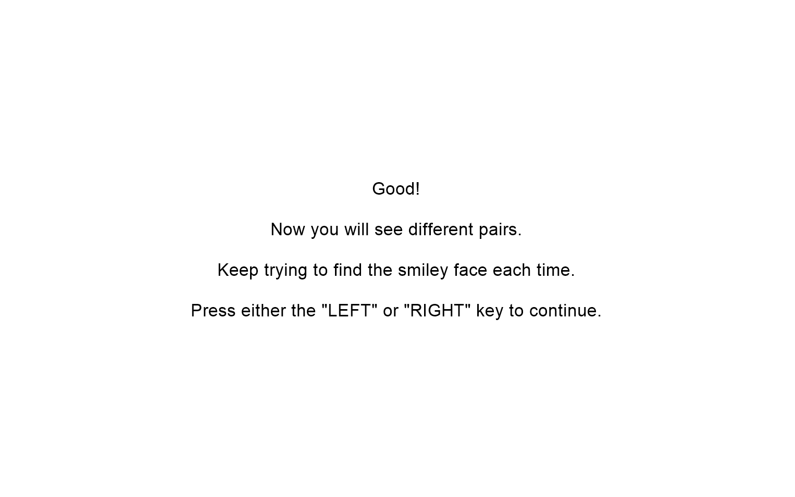
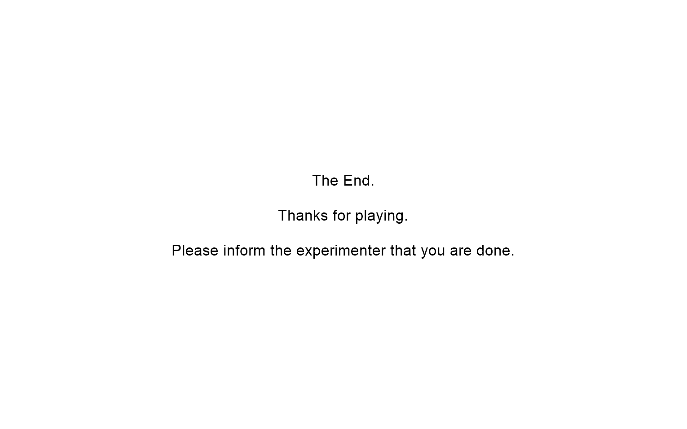

# Choose 34

## Description

The discrimination-and-transfer (“Choose”) task is a concurrent visual
discrimination task, followed by a generalization (probe) phase in which
irrelevant stimulus features are altered. In the training phase, subjects
learn a number of discriminations between pairs of colored shapes; in each
pair, one feature is relevant and one is redundant and therefore
irrelevant. For example, in the training phase, subjects might learn to
choose one object (green mushroom) in preference to another (brown
mushroom); in this example,color is predictive but shape is redundant and
therefore irrelevant.  Other pairs differ in shape (relevant) but not color
(irrelevant).  Later, in the probe phase, irrelevant features are altered.
Thus, subjects might be presented with a green frame and a brown frame;
color is still predictive (green still beats brown) but the irrelevant
shape feature has been altered.  Healthy controls typically generalize
well, but amnesic patients with bilateral hippocampal damage (Myers, DeLuca
et al., 2008) and non-demented elderly with bilateral hippocampal atrophy
(Myers, Kluger et al., 2002) both show impaired generalization.

The task design was described in Myers, Kluger et al. (2002) and was
subsequently modified to allow the user to specify various details of the
training and probe phases. This version of the software was used in several
recent papers including Anastasides et al. (2015), in which veterans with
more severe symptoms of post-traumatic stress disorder (PTSD) symptoms
showed an increased tendency to generalize, compared to peers with few/no
PTSD symptoms.

## PsychoPy Implementation

The PsychoPy implementation of the main parts of Choose 34 is
broken down into the following routines:



- Setup:
  
  - Before experiment:

    - Imports libraries that are used in the experiment.
    - Defines constants that are used throughout the experiment or for
    records purposes.
    - Initializes variables that are used throughout the experiment

  - Beginning of experiment (after settings are entered):

    - Validates and applies experiment's user-entered settings.
    - Initializes variables that are used throughout the experiment,
    for different purposes.
    - Assigns which objects have a smiley face at random.
    - Generates the `trialsLoop` condition files found in
    `GluckLab/choose34/experimentFiles`. These files contain all the
    image stimulus that will be shown to the subject. By setting the
    the `loopType` parameter in `trialsLoop` to `random` we make sure
    the stimulus are shown in a random order without repetition within each
    block of trials.
    - Initializes data summary variables which are updated every trial
    depending on the subject's responses.

- Experiment Instructions:
  
  - Begin Routine:

    - Simple screen with text instructions and a sample of the smiley face:

      

    - Routine terminates once the subject gives any valid keyboard response.

- Trials Setup:

  - Begin Routine:

    - Sets the path to the `trialsLoop` condition file according to the
    current phase.
    - Sets the `criterion` variable to one of the following:

      - Three, if the current phase is the practice phase.
      - Twice the number of pairs, if the current phase is not the practice
      phase and evaluating to criterion.
      - Infinity, if the current phase is not the practice
      phase and evaluating for a fixed number of trials.

- Choose:

  - Begin routine:

    - Shows the pair of objects to the subject and prompts a keyboard
    response:
      

  - End routine:

    - Update number of consecutive correct responses based on subject's
    response.
    - If in the practice phase, and if it's the first time the subject
    chose an object, then we assign the smiley face to the object which
    the subject **did not** choose.
    - Updates the data summary variables based on subject's response.

- Reveal:

  - Begin Routine:

    - "Lifts" the object chosen by the subject to reveal whether the smiley
    face is under them or not. This is done by updating the position of the
    image stimulus every frame conditioned on the subject response:
      

  - End routine:

    - If the subject's consecutive correct responses reached the
    `criterion`, we update the `currentPhase` to the next phase and we
    terminate trials loop early by setting `trialsLoop.finished = True`.
    In the case that we are evaluating to a fixed number of trials
    `criterion` is set to infinity, so early transition will never happen.

- Post-Practice Instructions:

  - This routine occurs only after the practice phase. This is achieved
  by enclosing the routine in a loop (`Post-Practice Screen Loop`)
  which has 1 repetition if `currentPhase` is the practice phase or
  0 repetitions otherwise.

  - Begin routine:

    - Simple screen with text instructions:
      
    - Routine terminates once the subject gives any valid keyboard response.

- Transtion

  - Begin Routine:

    - In case there was no early transition, this updates `currentPhase`
    to the next phase after the trials loop is finished.

- End Experiment:

  - Begin routine:

    - Creates a summary csv file where we can find the following fields:
  
    - Shows a simple screen with text instructions:

      

    - Routine and experiment terminate once the subject gives any valid
      keyboard response.

## Generating Stimuli Files

PsychoPy's loops have a condition parameter that can be pointed to a CSV
or excel file. The header row of the file defines the names of a set of
variables which will be available for use within the loop and
their values will be updated each iteration in accordance to one of the
rows below the header row.

The stimuli files are CSV files, each named after the phase to which they belong to. They can be found in `GluckLab/experimentFiles` and they
define the stimuli for the phase they are named after. These are
regenerated at the beginning of each experiment to account for the
random assignment of the smiley face.

The training and testing files define three varaibles:
`Left_Stim`, `Right_Stim`, and `Correct_Response`.
The practice file defines only two: `Left_Stim` and `Right_Stim`.
This is because we cannot define the correct responses for the practice
phase before the experiment begins as the smiley face is not assigned to
any practice object until the subject makes their first response. This
is okay since the practice phase does not need to be recorded and does
not contribute anything to the data files.

We populate each row of these files so that we have every possible
arrangement of the objects belonging to the phase as well as which
is the correct response to the stimuli defined in each row.
For example, if we are populating the `training.csv` file,
we have just one pair of objects: "brown mushroom" and "brown box", and we assign the smiley face to the "brown mushroom" object, then,
the `training.csv` file should look look like this:

|   Left_Stim   |     Right_Stim  | Correct_Response|
|---------------|-----------------|-----------------|
|brown mushroom |     brown box   |        left     |
|   brown box   | brown mushroom  |        right    |

In general lines to generate these stimuli files we need to:

- Loop through every phase, and create a file named after it.
- Loop through every pair of objects belonging to that phase.
- Check which of the two objects has the smiley face.
- Write two rows to the file:
  - One in which object 1 of the pair is the `Left_Stim` and object 2 is
  the `Right Stim`.
  - One in which object 2 of the pair is the `Left_Stim` and object 1 is
  the `Right Stim`.
  - Write the `Correct_Response` column in accordance with which of the objects has the smiley face.

So, first we need to know which objects have the smiley face.

### Assigning the Smiley Face

In this experiment, the objects come in pairs. Each object has a
a corresponding partner with which it is supposed to be with
whenever this object is shown to the subject on screen.
Furthermore, each training object has a corresponding
variation in the testing phase in which an irrelevant feature
(either color or shape) is replaced by a different one, i.e. a
corresponding testing object. If a training object, say, the brown mushroom
has been assigned to have the smiley phase then its corresponding
testing object, the yellow mushroom, must also be assigned to have
the smiley face.

To achieve random assignment of the smiley face for every run of the
experiment, we must be able to loop through the pairs of training
objects, assign the smiley face to one of them at random, find its
corresponding testing object and assign the smiley face to it as well.

Therefore we need to encode each pair as well as a mapping from each
training object to its corresponding testing object.

#### Encoding the Pairs of Objects and Mapping Training Objects to Testing Objects

One key constant defined in the contants section of the **Setup** routine is
the `pairs` dictionary. This dictionary encodes the pairs of objects, and
maps the training objects to their corresponding testing phase
variation. Each key in the dictionary is a tuple of training objects,
and it's value is the corresponding tuple of testing objects. The object
at index 0 of the key tuple, corresponds to the object at index 0 of the
value tuple, and the object at index 1 of the key tuple, corresponds to the
object at index 1 of the value tuple.

```python
pairs = {
    ("s3c1", "s3c2"): ("s3c1", "s3c2"),
    ("s1c3", "s2c3"): ("s1c96", "s2c96"),
    ("s10c8", "s10c98"): ("s13c8", "s13c98"),
    ("s8c11", "s9c11"): ("s8c26", "s9c26"),
    ("s18c15", "s18c16"): ("s21c15", "s21c16"),
    ("s15c17", "s16c17"): ("s15c5", "s16c5"),
    ("s24c22", "s24c23"): ("s25c22", "s25c23"),
    ("s22c24", "s23c24"): ("s22c25", "s23c25")
    }
```

So, we can loop through the training
objects and get their corresponding testing objects in the following way:

```python
for pair in pairs:
  train0, train1 = pair
  test0, test1 = pairs[pair]
```

Now we simply "assign" the smiley face to either the 0th or 1st object at
random. How we do this is with the `hasSmiley` dictionary, first defined in the variables section of the **Setup** routine. Each key of this dictionary
is an object and its value is True or False depending on whether that object
has been assigned the smiley or not.

```python
practice0, practice1 = practicePair

# Initially both practice objects have no smiley. This changes based on the
# subject's first choice. 
hasSmiley[practice0] = False
hasSmiley[practice1] = False

for pair in pairs:
    train0, train1 = pair
    test0, test1 = pairs[pair]
    
    r = random.randint(0,1)
    
    if(r == 0):
        hasSmiley[train0] = True
        hasSmiley[train1] = False
        hasSmiley[test0] = True
        hasSmiley[test1] = False
    else:
        hasSmiley[train0] = False
        hasSmiley[train1] = True
        hasSmiley[test0] = False
        hasSmiley[test1] = True
```

For the practice phase we do not assign the smiley face to either
object. This is because the subject's first response is always supposed to
be wrong. After the subject's first response, at the end of the **Choose**
routine we update the dictionary to assign the smiley face to the object which the subject did not choose.

```python
if(firstChoice and Subject_Response.keys == leftKey):
    hasSmiley[Right_Stim] = True
    hasSmiley[Left_Stim] = False
    firstChoice = False
elif(firstChoice and Subject_Response.keys == rightKey):
    hasSmiley[Right_Stim] = False
    hasSmiley[Left_Stim] = True
    firstChoice = False
```

Now that we have everything we need to generate our stimuli files, we
simply loop through every object, and write the necessary rows:

```python
with open(expFilesPath + "training.csv", "w") as f1:
    with open(expFilesPath + "testing.csv", "w") as f2:
        f1.write("Left_Stim,Right_Stim,Correct_Response\n")
        f2.write("Left_Stim,Right_Stim,Correct_Response\n")
        for pair in pairs:
            train0, train1 = pair
            test0, test1 = pairs[pair]
            if(hasSmiley[train0] and hasSmiley[test0]):
                f1.write(f"{train0},{train1},left\n")
                f1.write(f"{train1},{train0},right\n")
                f2.write(f"{test0},{test1},left\n")
                f2.write(f"{test1},{test0},right\n")
            else:
                f1.write(f"{train0},{train1},right\n")
                f1.write(f"{train1},{train0},left\n")
                f2.write(f"{test0},{test1},right\n")
                f2.write(f"{test1},{test0},left\n")
                
with open(expFilesPath + "practice.csv", "w") as f:
    f.write("Left_Stim,Right_Stim\n")
    practice0, practice1 = practicePair
    f.write(f"{practice0},{practice1}\n")
    f.write(f"{practice1},{practice0}\n")
```

## Different Numbers of Pairs

Another reason we have to generate the stimuli files with code
at the beginning of the experiment rather than simply having static files
is because we want to allow the user to change the number of pairs available
in the experiment, and in case the user decides to not use all the pairs
we want to choose which pairs are selected to be in the experiment to be
random as well. To achieve this depending on the `Number of pairs`
parameter from the user-entered settings, we elimnate
(`8 - Number of pairs`) of the `pairs` dictionary at random.

```python
delPairs = 8 - int(expInfo["Number of pairs"])
if(delPairs > 0):
    pairsToDelete = random.sample(pairs.keys(), delPairs)
    for pair in pairsToDelete:
        pairs.pop(pair)
```

## The Object "Lift" Animation and Smiley Reveal

The object ¨lift¨ animation done in the **Reveal** routine, is done by
changing the object's vertical position every frame using the following
formula:

```python
min(0.1, frameN/100)
```

Where `frameN` is the frame number since the start of the routine.
Note that all  image sitmuli are set to sync their timing with the display's
refresh rate. This means that the animation speed will change depending on the
refresh rate of the device the experiment is run on. The animation was developed
on a device with a screen refresh rate of 144 Hz, as such,
the animation will look better in device with similar display refresh rate.

The spatial units for the experiment are measured as fractions of the
screen size anchored at the center of the screen. Hence, the formula
updates the object's vertical position, "lifting" it from the center height
of the screen 1% of the screen size every frame, until it is "lifted" to
10% of the screen size above the center's height.

An object should be lifted only if the subject chose that object
in the **Choose** routine. Therefore, the object's vertical position either
remains constant or it is "lifted" depending on the subject's choice.
So, the full formula for an object's position in the **Reveal** routine is
as follows (taking the left object as example):

```python
[-0.25, min(0.1, frameN/100)] if (Subject_Response.keys == leftKey) else [-0.25, 0]
```

However this animation created a problem. The smiley face position
is set to be equal to the starting position of whichever object is the
correct one using this formula:

```python
(-0.25, 0) if hasSmiley[Left_Stim] else (0.25, 0)
```

In an earlier iteration of the experiment, the objects were square PNG
files with a white background. This was used to hide the smiley face
behind the object. But, since the objects' positions are updated every
frame even when the object is not being lifted, the smiley face shows
through the object. To remedy this, the opacity of the smiley face is
set to either completely transparent (`0`) or completely opaque (`1`)
depending on if the subject chose the correct object or not:

```python
1 if correctResponse else 0
```

This solved the problem of the smiley face showing through the correct
object when the subject chose the wrong object. But, it still showed
through from behind the object when the subject chose the correct object
before the object was "lifted."
Therefore, we introduced 0.15 second delay on the start time for the
smiley face and shortened it's duration to 0.85 seconds, which solved
this second problem and allowed us to make all the objects have a
transparent background. Making the the backgrounds transparent made
it so the objects didn't look like patches on the screen, improving
the overall visual quality of the experiment. This small delay also
made it so the experiment looks more alike the Choose 33 MacOS experiment.

## Data

PsychoPy automatically generates a data file which contains all
the necessary information about the experiment, each stimuli and subject
response. However, these files (found in the `GluckLab/choose34/data/`
directory) also contain unnecessary information which makes the file
a little cluttered. Addtionally, a custom summary statistics
file is also generated (found in the `GluckLab/choose34/data/summaries`
directory). This file is a CSV file with the following fields:

| Field | Description|
|-------|------------|
|Experiment| Experiment name, i.e. "Choose34."|
|Subject ID| Value for the `Participant` field entered in the experiment settings. |
| Experimenter | Value for the `Experimenter` field entered in the experiment settings. |
| Date | Date experiment started in the format `Weekday(full name), Month(full name) Day(dd), Year(yyyy)`|
| Time | Time the experiment started in the format `Hour(00-12):Minute(00-59):Second(00-59) AM/PM`|
| Training Accuracy Average | Subject's accuracy $\left(\frac{\text{\# Correct Responses}}{\text{\# Responses}}\right)$ during the training phase.
| Training RT Average | Average response time in seconds during the training phase. |
| Training Errors | Number of errors the subject had during the training phase. |
| Probe Accuracy Average | Subject's accuracy $\left(\frac{\text{\# Correct Responses}}{\text{\# Responses}}\right)$ during the probe/testing phase.
| Probe RT Average | Average response time in seconds during the probe/testing phase. |
|Probe Errors | Number of errors the subject had during the probe/testing phase. |

This summary file contains all the data ready to be uploaded to the Gluck Lab data
base.
