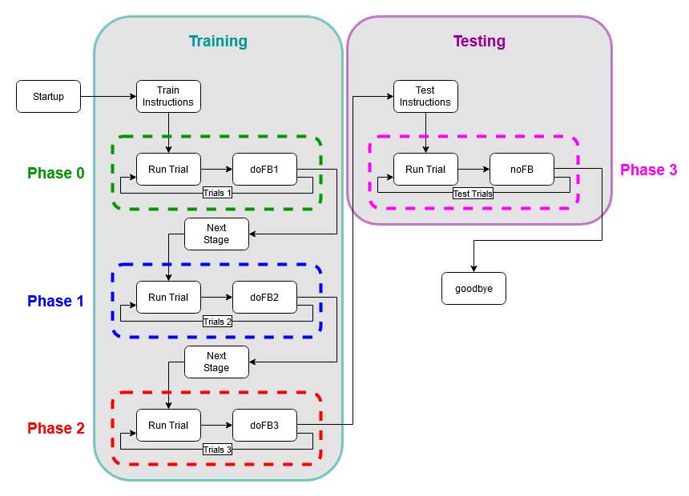

# Fish 15

## Task Description

The Fish task is an acquired equivalence task, in which training to treat
two stimuli as equivalent should increase generalization between them. The
design is based on that described in Myers et al. (2003). Specifically,
during several training stages, subjects first learn to associate
antecedent stimuli (here, faces) with different consequents (here,
colored fish). Included in the training are several antecedents that
are implicitly equivalent, in the sense of being mapped to the same
consequents.  During a final training stage, some antecedents are
paired with new consequents. The training phase is followed by a testing
stage that interleaves retention trials with previously trained pairs as
well as generalization trials: e.g., given that Face A is mapped to fish X,
and Faces A and B are equivalent, will subjects assume that Face B also
goes with fish X?  Healthy adults reliably show acquired equivalence,
which is disrupted in patients with hippocampal region dysfunction,
including amnesic patients with bilateral hippocampal destruction
(Myers et al., 2008) and non-demented elderly with hippocampal atrophy
consistent with prodromal Alzheimer’s disease (Myers et al., 2003).

## PsychoPy Implementation

The PsychoPy implementation of Fish 15, is a modified version of the Fish 14
implementation (written by Catherine Myers). The implementation is broken
down into the following routines:

