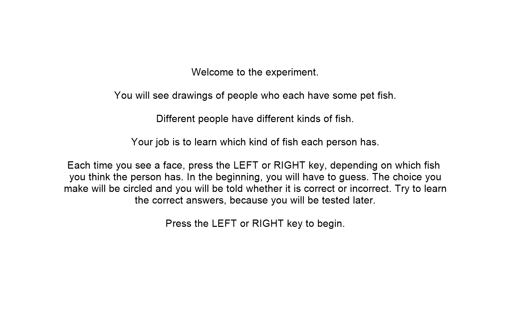
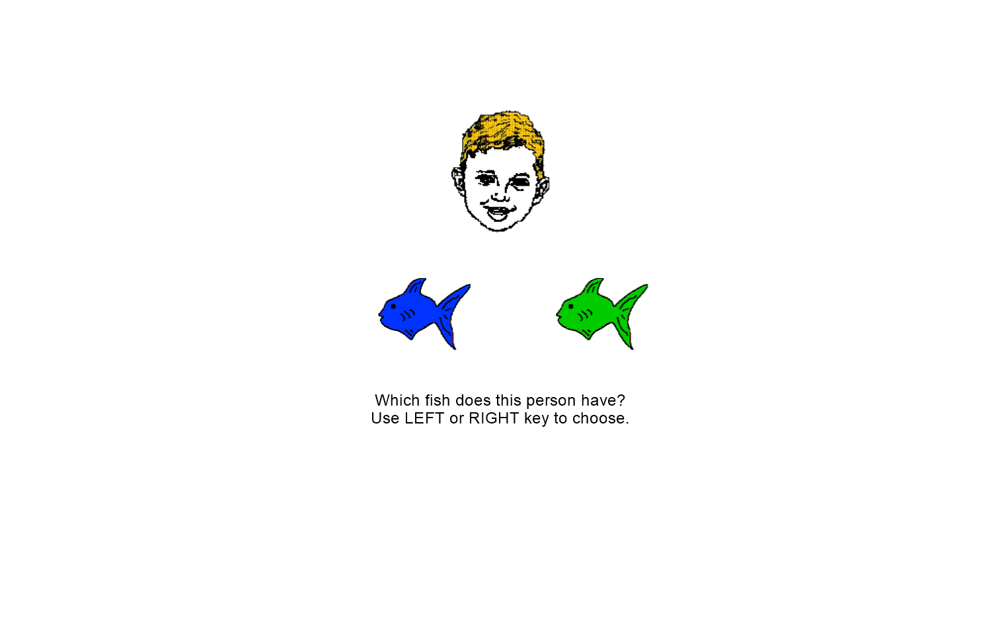
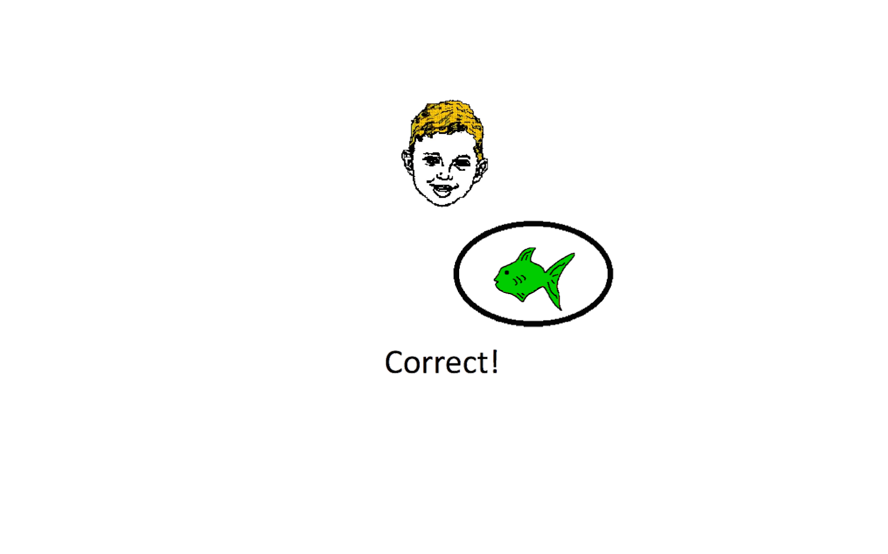
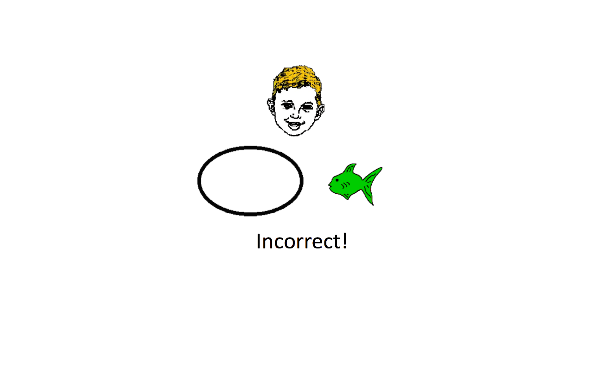
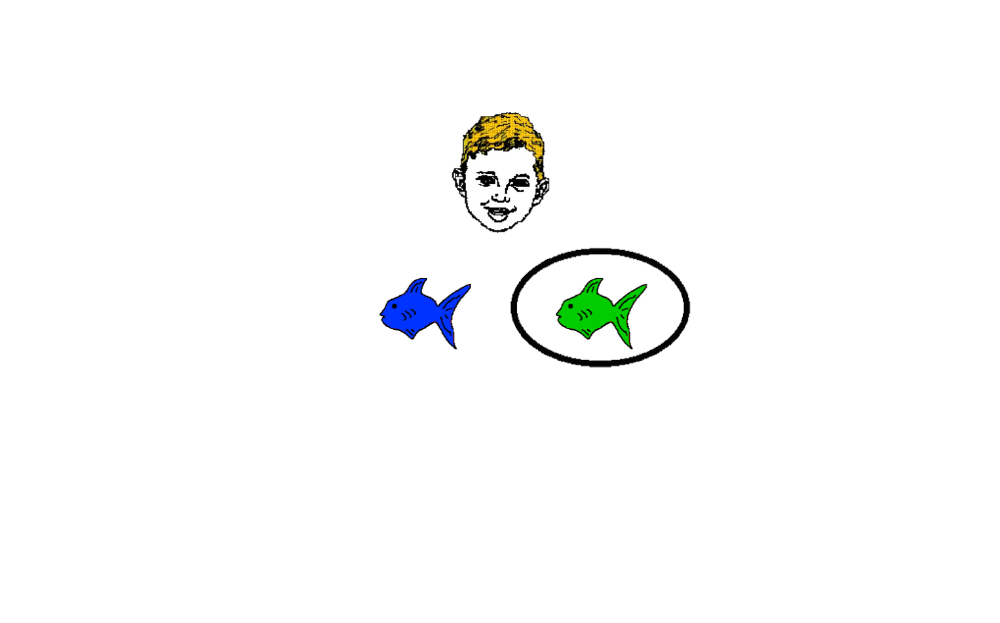
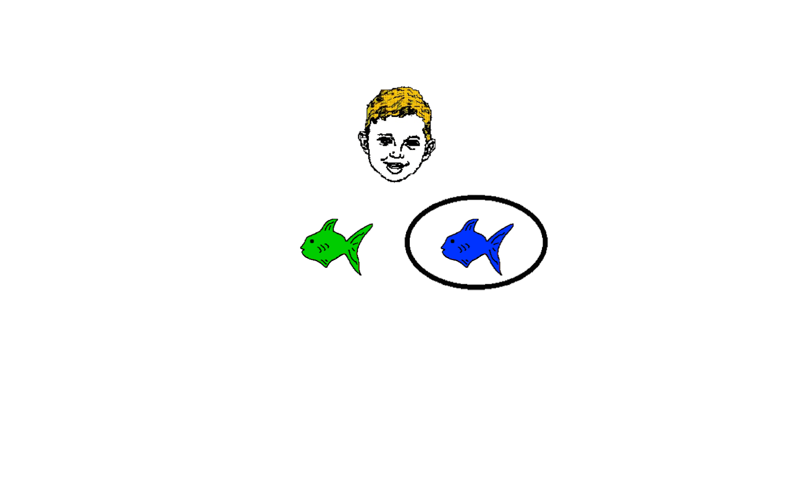
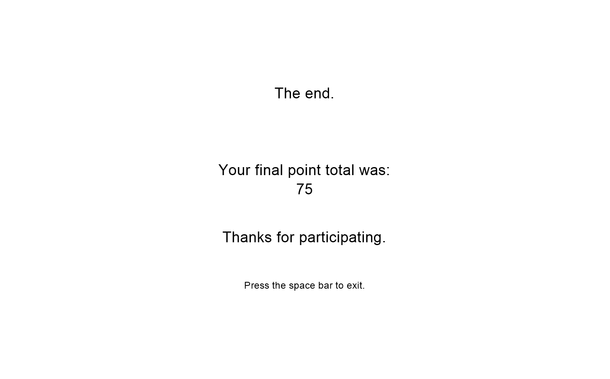

# Fish 15

## Task Description

The Fish task is an acquired equivalence task, in which training to treat
two stimuli as equivalent should increase generalization between them. The
design is based on that described in Myers et al. (2003). Specifically,
during several training stages, subjects first learn to associate
antecedent stimuli (here, faces) with different consequents (here,
colored fish). Included in the training are several antecedents that
are implicitly equivalent, in the sense of being mapped to the same
consequents.  During a final training stage, some antecedents are
paired with new consequents. The training phase is followed by a testing
stage that interleaves retention trials with previously trained pairs as
well as generalization trials: e.g., given that Face A is mapped to fish X,
and Faces A and B are equivalent, will subjects assume that Face B also
goes with fish X?  Healthy adults reliably show acquired equivalence,
which is disrupted in patients with hippocampal region dysfunction,
including amnesic patients with bilateral hippocampal destruction
(Myers et al., 2008) and non-demented elderly with hippocampal atrophy
consistent with prodromal Alzheimer’s disease (Myers et al., 2003).

## Data

PsychoPy automatically generates a data file which contains all
the necessary information about the experiment, each stimuli and subject
response (found in the `GluckLab/fish15/psychopyOutput/` directory).
Addtionally, a custom data and summary statistics file are also generated
(found in the `GluckLab/fish15/data/` and `GluckLab/fish15/data/summaries`
directories respectively). The custom data file is made to be identical
in format to that of Fish8.1a simply so that Gluck Lab members can do
data analysis without having to change their approach at all.
However, custom data file contains the same information as the one
automatically generated by PsychoPy. The summary file is a CSV file with the
following fields:

| Field | Description|
|-------|------------|
|Subject | Value for the `Participant` field entered in the experiment settings. |
|Experiment| Experiment name, i.e. "Fish15."|
| Experimenter | Value for the `Experimenter` field entered in the experiment settings. |
| Date | Date experiment started in the format `Weekday(full name), Month(full name) Day(dd), Year(yyyy)`.|
| Time | Time the experiment started in the format `Hour(00-12):Minute(00-59):Second(00-59) AM/PM`.|
| Acquisiton | Subject's accuracy during the training phases (phases 0 through 2) $\left(\frac{\text{Correct Responses}}{\text{Acquisition Trials}}\right)$.
| Acquisitoin Trials | Number of training trials (all trials from phases 0 through 2).|
| Retention | Subject's accuracy during the probe/testing phase (phase 3) on stimuli previously seen in the training phases (phases 0 through 2) $\left(\frac{\text{Correct Responses}}{\text{Retention Trials}}\right)$.|
| Retention Trials | Number of trials in the probing/testing phase (phase 3) in which the subject was shown a stimulus previously shown on the training phases (phases 0 through 2)|
| Generalization | Subject's accuracy during the probe/testing phase (phase 3) on critical pair stimuli $\left(\frac{\text{Correct Responses}}{\text{Generalization Trials}}\right)$.|
| Generalization Trials | Number of trials in the probe/testing phase (phase 3) in which a critical pair stimulus was shown (it should be 12 trials).|

This summary file contains all the data ready to be uploaded to the Gluck Lab database.

## PsychoPy Implementation

The PsychoPy implementation of Fish 15, is a modified version of the Fish 14
implementation (written by Catherine Myers). The implementation is broken
down into the following routines:


- Startup:
  - Before Experiment:
    - Generates a file with the face-fishes pairings to be used in the
        current run of the experiment. This file is found in
        `GluckLab/fish15/experimentFiles` and is named
        `face_fish_pairings.csv`. These pairings are randomly generated
        with each run of the experiment.
    - Generates a csv file for each phase of the experiment. These
        files uses the pairings defined in the `face_fish_fish.csv` file
        to generate the stimuli used for each phase.
  - Begin Routine:
    - It creates and writes the header to the experiment's data file
        found in `GluckLab/fish15/data`. This is **not** the data file
        that is automatically generated by PsychoPy, but rather a custom
        one that is made to be identical to Fish 8.1a's data file. The
        data file that is automatically generated by PsychoPy and partially
        modified by the experiment's code (legacy code from Fish 14) can
        be found in `GluckLab/fish15/psychopyOutput`

- Train Instructions:
  - Begin Routine:
    - Initializes data summary variables (acquisition, retention,
        generalization scores, etc.)
    - Initializes variables that are used by Fish 14's legacy code.
    - Writes the header for that face onto the custom data file.
    - Shows a screen with the instructions for the training phases of
        the experiment.
        

- Run Trial:
  - Begin Routine:
    - Shows a screen with a face and two fishes and prompts the subject
        to choose which fish corresponds to that face.
        
  - End Routine:
    - Updates the summary variables based on the results of the current
        trial.
    - Records the stimuli and results of this trial onto the custom
        data file.

- DoFBX:
  - Begin Routine:
    - Reveals the correct answer to the subject by showing a circle of
        in the positon of their response, hiding the incorrect choice, and
        showing a text saying either correct or incorrect.
        
        
  - End Routine:
    - If the subject's consecutive correct answers have reached the
        criterion value then the current phase is terminated early.

- Next Stage:
  - Begin Routine:
    - Updates the criterion value for the next phase and resets the
        number of consecutive correct answers.
    - Writes the header for the next phase onto the custom data file.

- Test Instructions:
  - Begin Routine:
    - Writes the header for the test phase onto the custom data file.
    - Shows the instructions for the probing/testing phase of the
        experiment (phase 3).
        

- NoFB:
  - Begin Routine:
    - Updates variables used by the Fish 14 legacy code.
    - Shows a circle in the postion of the subject's response (left or
        right). This routine **does not** reveal the correct answer in any form,
        regardless of the subject's response.
        
        

- Goodbye:
  - Begin Routine:
    - Calculates the subject's acquisition, retention, and
        generalization score.  
    - Creates and writes a summary file with all the scores
        and experiment information (subject, experiment, experimenter,
        date, and time). This file can be found in
        `GluckLab/fish15/data/summaries`.
    - Shows a screen instructing the subject that the experiment has
        ended, along with a tally of their correct responses throughout
        the experiment.
        

## Phases

On each phase the subject is prompted to choose one of two fishes that
corresponds to the face on screen. Phases 0-2 are training phases.
During the training phases, after the subject chooses a fish, the correct answer is revealed regardless of if the subject was correct or not.
Phase 3 is the probing/testing phase. This phase is almost exactly like the
phases but the correct answers are no longer shown to subject.

There are a total of four fishes. These are randomly grouped into two pairs.
Each face is randomly assigned a pair of fishes at the beginning of the
experiment. The grouping and assignment is randomized everytime the
experiment is run. An example of the face-fish pairings could be the
following:

|Face|Fishes|
|----|----|
|Boy|Green, Purple|
|Girl|Green, Purple|
|Woman|Red, Blue|
|Man|Red, Blue|

We start the experiment by showing the subject only two faces and two
fishes, then each phase increases the number of faces and fishes that
are shown on screen. The following table summarizes the
differences between each phase:

|Phase | Number of Fishes | Number of Faces |
|------|------------------|-----------------|
|0|2|2|
|1|2|4|
|2*|4|4|
|3| 4| 4|

*(Some "critical" face-fishes pairs are not included in phase 2. This is
further explained later in this section)

As it is summarized in the table above, phase 0 has two fishes and two
faces, each fish corresponding to one face. For example:

|Face|Fish|
|----|----|
|Boy|Green|
|Woman|Red|

In phase 1, we increase the number of faces to four but the number of fishes
remains the same. Each fish corresponds two faces. For example:

|Face|Fish|
|----|----|
|Boy|Green|
|Woman|Red|
|Girl|Green|
|Man|Red|

In phase 2, we include all the fishes and all the faces,
however we exclude two pairings that will not be shown to the
subject during training. These pairings are called "**Critical Pairs**", and are used
in phase 3 to test the subject's generalization performance. For example:

|Face|Fishes|
|----|----|
|Boy|Green, Purple|
|Woman|Red, Blue|
|Girl|Green|
|Man|Red|

In this example the (Girl, Purple) and (Man, Blue) pairings are excluded
from this phase, and thus excluded from all training phases. However,
by seeing the other pairings, the subject can
deduce (or *generalize*) that the purple fish corresponds to the girl face
and that the blue fish corresponds to the man face. The subject's
accuracy in these first 3 phases is the subject's "acquisition" score.

Finally, in phase 3 we stop showing the correct answers and use all of the
pairings:

|Face|Fishes|
|----|----|
|Boy|Green, Purple|
|Woman|Red, Blue|
|Girl|Green, Purple|
|Man|Red, Blue|

In this manner, we can test the subject's "retention" (how
accurate the subject's responses are when prompted with a pairing that was
**previously seen**) and "generalization" (how accurate the
subject's responses are when promptes with a pairing **not previously
seen**, i.e., when prompted with a "critical pair").

## Generating Stimuli Files

### Face-Fish Pairings

As metioned in the **Phases** section, first we generate a file
which contains the face-fish pairings that will be referenced to generate
the stimuli files of each phase. These pairings must be generated at
random each time the experiment is run. To do this we make two lists:
one containing all the faces, another containing all the fishes. Then
we generate 4 *distinct* random integers spanning the range $[0, 3]$.
Call these random integers $r_1, r_2, r_3, r_4$. This setup makes it so
that each one of these numbers can be used to reference a unique random
index in both the `faces` and `fishes` list. Then we assign the pairings
in the following way:

|Face| Fish1 | Fish2 |
|----|-------|-------|
|`faces[r1]`|`fishes[r1]`|`fishes[r2]`|
|`faces[r2]`|`fishes[r1]`|`fishes[r2]`|
|`faces[r3]`|`fishes[r3]`|`fishes[r4]`|
|`faces[r4]`|`fishes[r3]`|`fishes[r4]`|

This assures that the pairings are randomized with every run of the
experiment and that every face has another "partner" face which
shares the same pair of fishes. This pairings are written as a CSV
file to `GluckLab/experimentFiles/face_fish_pairings.csv`

### Stimuli Files

The stimuli file for each phase is a CSV file where the header defines
the names of a set of variables (`face`, `leftFish`, `rightFish`,
`correctResponse`). These variables assume the values defined by
a row under the header with each iteration of the `trialsX` loop (where `X`
is either 1, 2, or 3) or the `test_trials` loop. Using the face-fish
pairings example from the previous section, the following table is an
example of how a phase 0 stimuli file (`phase0.csv`) would look like:

|face|leftFish|rightFish|correctResponse|
|----|--------|---------|---------------|
|woman|green|blue|left|
|woman|blue|green|right|
|girl|blue|green|left|
|girl|green|blue|right|

As illustrated above, the rows of the stimuli file are all the possible
arrangenments of face and fish pairs where one choice of fish is correct
and the other is incorrect. Each iteration, the corresponding loop object
sets the varibles defined by the header to the values defined by a randomly
selected row.

To generate these files we use a function with the following signature:

```python
def generate_phase_file(pairings, phase_faces, phase_fishes, filename):
    '''
    Generates a csv file with every valid combination of face 
    left_fish and right_fish. 
    Args:
        pairings: a dictionary containing all the face-fish pairings in the 
                  format pairings[face] = {fish1, fish2}
        phase_faces: a list of strings with the base file name of the faces that 
                     correspond to the desired phase
        phase_fishes: a list of strings with the base file name of the fishes 
                      that correspond to the desired phase
    Returns:
        None. It instead generates [filename].csv that lists the stimuli for the
        desired phase
    '''
```

First we write the header of the CSV file. This defines the names of the
variables whose values will be set by the loop object in the experiment:

```python
file = open(filename, "w", newline="")
    header = ["face","leftFish","rightFish","correctResponse"]
    writer = csv.writer(file, delimiter=",", quotechar="\"", 
                            quoting=csv.QUOTE_NONNUMERIC)
    writer.writerow(header)
```

Then we loop through the `phase_faces` list. In the loop, we determine which
fishes from the `phase_fishes` list belong to the current `face` and which fishes do not belong to the current `face` using the `pairings` dictionary:

```python
for face in phase_faces:
        # Create a list of the fishes that the face above owns and does not own
        not_owned_fishes = []
        owned_fishes = []
        for fish in phase_fishes:
            if(fish in pairings[face]):
                owned_fishes.append(fish)
            else:
                not_owned_fishes.append(fish)
```

As seen above, we created two new lists: `owned_fishes` and `not_owned_fishes`.
These represent fishes that belong and the fishes that do not belong to the
current `face`, respectively. Note that these list will always have the same length
as each other (either 1 or 2). Finally, we write rows until we exhaust both
of these lists. We do this in the following manner:

```python
# owned_fishes and not_owned_fishes have the same length
for i in range(len(owned_fishes)):
    correct = owned_fishes[i]
    incorrect = not_owned_fishes[i]
    row1 = [face, correct, incorrect, "left"]
    row2 = [face, incorrect, correct, "right"]
    writer.writerow(row1)
    writer.writerow(row2)
```

As illustrated above, we write the rows in pairs: one where the correct fish
is on the left and another where the correct fish is on the right.
In this way we include every possible arrangement of the face and fish pairs
where one choice of fish is correct and the other is incorrect.

### Critical Pairs

As explained in the Phases section, critical pairs are face-fish pairings
that we purposely leave out from the traning phases (phases 0 through 2),
to evaluate the subject's performance on the testing phase.
However, there is enough information shown in the training phases
for the subject to be able to *generalize* or extrapolate what the
unknown face-fish pairings are. 

Let the face-fish pairings be represented by the following:

|Face|Fishes|
|----|----|
|A|a, b|
|B|a, b|
|C|c, d|
|D|c, d|

The pairs that are selected to be critical pairs are $(B, b)$ and $(D, d)$.
For example, with the following pairings:

|Face|Fishes|
|----|----|
|Boy|Green, Purple|
|Girl|Green, Purple|
|Woman|Red, Blue|
|Man|Red, Blue|

The critical pairs would be (Girl, Purple) and (Man, Blue). And, although the critical pairs are selected in this deterministic manner,
since all the pairings are randomized with every run, then so are the
critical pairs.

As explained before, these critical pairs are to be included only on
the probe/testing phase (i.e. phase 3). However, the function
we used to generate our phase files include every possible arrangement
of face and fish pairs where one choice of fish is correct and
the other is incorrect. And, since both phase 2 and phase 3 use
all faces and all fishes, then their stimuli files will have all pairs after
using the `generate_phase_file` function. Therefore, we must remove
the stimuli containing critical pairs from the phase 2 stimuli file
(i.e. `phase2.csv`). For this purpose, we created another function
which finds and deletes every row that contains a critical pair from
a given phase file:

```python
def remove_crit_pairs(faces, fishes, filename, pairings):
    '''
    Removes and returns the critical pairs from the phase file with 
    name `filename`. This should only be used for a phase which is not the test
    phase and was generated with all the faces and fishes, i.e. phase 2.
    Args:
        faces: a list of all the faces
        fishes: a list of all the fishes
        filaneme: the file name of the phase file to modify
        pairings: a dictionary containing all the face-fish pairings in the 
                  format pairings[face] = {fish1, fish2}
    Returns:
        a set of all stimuli containing critical pairs 
        in comma separated string format
    '''
```
The way this function works is simpy by iterating through all the 
rows in `filename`, check if the row contains a critical pair,
if it does not contain a critical pair we include it on the
new rows for the file, if it does contain a critical pair
we do not include it in the new rows for the file. To do this,
first we define the pairs we do not want to include (the critical pairs):

```python
 # Phase 3 critical pairs:
    # Face B: Fish b, Face D: fish d
    do_not_include = {faces[1]: pairings[faces[1]][1], faces[3]: pairings[faces[3]][1]}
```

Now we open the file, iterate through the rows, and check if the rows
should be included or not by identifying if the row contains a critical
pair or not:

```python
    file = open(filename, "r")
    reader = csv.DictReader(file)
    rows = []
    crit_pairs_stims = set()
    for row in reader:
        face = row["face"]
        fish1 = row["leftFish"]
        fish2 = row["rightFish"]
        correct = row["correctResponse"]
        # If the face is not one of the critical pairs of phase 3 then 
        # it should be included in phase 2
        should_include = not ((face in do_not_include) and 
            (fish1 == do_not_include[face] or fish2 == do_not_include[face]))
```
The `rows` list, represents the final rows that will be included in the
file (i.e. all rows except the ones containing critical pairs). 
The `crit_pairs_stims` set stores comma separated string representations
of the critical pairs stimuli. If the row we are currently reading
does not contain a critical stimulus, we append it to the `rows` list,
otherwise we add it to the `crit_pair_stims` set.

```python
        if (should_include): # not a critical pair
            rows.append([face, fish1, fish2, correct])
        else: # critical pair
            stim =  ",".join([face, fish1, fish2, correct])
            crit_pairs_stims.add(stim)
            continue
    file.close()
```
Finally, we overwrite the phase file with the new rows which do not 
include critical pairs. 

```python
    file = open(filename, "w", newline="")
    header = ["face","leftFish","rightFish","correctResponse"]
    writer = csv.writer(file, delimiter=",", quotechar="\"", 
                            quoting=csv.QUOTE_NONNUMERIC)
    writer.writerow(header)
    for row in rows:
        writer.writerow(row)
    file.close()
    
    return crit_pairs_stims
```

This function also has the double purpose of returning the
`crit_pairs_stims` set which holds all the stimuli containing critical
pairs. We later reference this set in phase 3 to easily identify the
trials in which the subject is dealing with a critical pair.
In this way we can score the subject properly and mark the critical
pair trials on the custom data file.

After executing this function on the phase 2 stimuli file, 
we successfully remove all stimuli containing critical pairs
from it and store these stimuli for later reference.